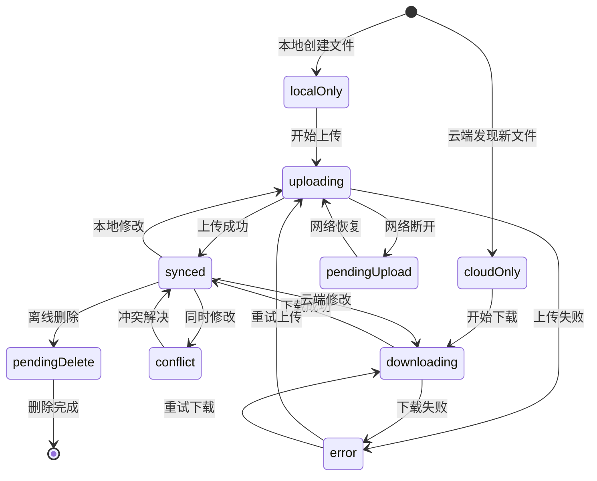

# CloudDrive 文件同步规则详细文档

## 📋 概述

本文档详细定义了 CloudDrive 系统中文件同步的各种场景、规则和处理机制。涵盖本地文件操作、云端文件变更、网络状态变化、多设备协作、系统异常恢复以及冲突解决等所有同步相关的业务逻辑。

## 🎯 同步目标

- **双向同步**：本地和云端文件保持一致
- **多设备协作**：支持多个设备同时访问和修改
- **冲突解决**：智能处理同时修改的文件
- **离线支持**：网络断开时记录操作，恢复后同步
- **增量同步**：只同步变更的文件，提高效率
- **状态透明**：用户可清楚了解文件同步状态
- **数据完整性**：确保文件传输和存储的完整性
- **原子操作**：保证操作的原子性，避免中间状态

## 📊 文件同步状态定义

### 基础状态

| 状态 | 代码 | 描述 | 图标 | 离线可用 | 优先级 |
|------|------|------|-------|----------|---------|
| 仅本地 | `localOnly` | 文件只存在于本地，未上传到云端 | ↑ | ✅ | 中 |
| 仅云端 | `cloudOnly` | 文件只存在于云端，未下载到本地 | ☁️ | ❌ | 低 |
| 已同步 | `synced` | 本地和云端文件完全一致 | ✅ | ✅ | - |
| 上传中 | `uploading` | 正在上传到云端 | ↑● | ✅ | 中 |
| 下载中 | `downloading` | 正在从云端下载 | ↓● | ❌ | 低 |
| 冲突 | `conflict` | 本地和云端都有修改，需要解决冲突 | ⚠️ | ✅ | 高 |
| 等待上传 | `pendingUpload` | 离线时创建/修改，等待网络恢复后上传 | ⏳↑ | ✅ | 中 |
| 等待删除 | `pendingDelete` | 离线时删除，等待网络恢复后同步删除 | ⏳🗑️ | ❌ | 高 |
| 同步错误 | `error` | 同步过程中发生错误 | ❌ | 取决于本地是否有文件 | 高 |
| 部分上传 | `partialUpload` | 大文件部分上传完成，等待继续 | ↑◐ | ✅ | 中 |
| 部分下载 | `partialDownload` | 大文件部分下载完成，等待继续 | ↓◐ | 部分 | 低 |
| 校验中 | `verifying` | 正在校验文件完整性 | 🔍 | ✅ | 中 |
| 锁定中 | `locked` | 文件被其他进程锁定，等待释放 | 🔒 | ✅ | 低 |
| 等待移动 | `pendingMove` | 离线时移动/重命名，等待同步 | ⏳📁 | ✅ | 中 |
| 临时状态 | `temporary` | 临时文件，等待确认或清理 | ⏱️ | ✅ | 低 |

### 状态转换规则



## 🔄 同步场景详细规则

### 1. 本地文件操作

#### 1.1 本地创建文件

**场景**：用户在本地创建新文件

**处理流程**：
1. 文件状态设置为 `localOnly`
2. 生成文件元数据并存储到本地数据库
3. 如果网络在线：
   - 立即添加到上传队列
   - 状态变更为 `uploading`
   - 执行上传操作
4. 如果网络离线：
   - 状态保持为 `localOnly`
   - 标记为 `pendingUpload`
   - 等待网络恢复

**代码实现**：
```swift
func handleLocalFileCreated(localPath: String, fileName: String, parentId: String) {
    let fileId = generateFileId(parentId: parentId, fileName: fileName)
    let metadata = FileMetadata(
        fileId: fileId,
        name: fileName,
        parentId: parentId,
        isDirectory: false,
        syncStatus: .localOnly,
        localPath: localPath,
        localModifiedAt: Date()
    )
    
    updateMetadata(metadata)
    
    if networkStatus == .online {
        let remotePath = generateRemotePath(parentId: parentId, fileName: fileName)
        addToSyncQueue(.upload(fileId: fileId, localPath: localPath, remotePath: remotePath))
    }
}
```

#### 1.2 本地修改文件

**场景**：用户修改已存在的本地文件

**处理流程**：
1. 检查文件当前状态
2. 更新本地修改时间
3. 根据当前状态决定处理方式：
   - 如果是 `synced`：变更为 `localOnly`，准备上传
   - 如果是 `localOnly`：保持状态，更新修改时间
   - 如果是 `conflict`：保持冲突状态
4. 如果网络在线且无冲突：添加到上传队列

**代码实现**：
```swift
func handleLocalFileModified(fileId: String, localPath: String) {
    guard var metadata = getMetadata(fileId: fileId) else { return }
    
    let fileAttributes = try? FileManager.default.attributesOfItem(atPath: localPath)
    let modifiedDate = fileAttributes?[.modificationDate] as? Date ?? Date()
    
    metadata.localModifiedAt = modifiedDate
    
    switch metadata.syncStatus {
    case .synced:
        metadata.syncStatus = .localOnly
        updateMetadata(metadata)
        
        if networkStatus == .online {
            addToSyncQueue(.upload(fileId: fileId, localPath: localPath, remotePath: metadata.remotePath!))
        }
        
    case .localOnly, .pendingUpload:
        updateMetadata(metadata)
        
    case .conflict:
        // 保持冲突状态，等待用户解决
        updateMetadata(metadata)
        
    default:
        break
    }
}
```

#### 1.3 本地删除文件

**场景**：用户删除本地文件

**处理流程**：
1. 检查文件当前状态
2. 根据状态决定处理方式：
   - 如果是 `localOnly`：直接从数据库删除
   - 如果是 `synced` 或 `cloudOnly`：需要同步删除到云端
   - 如果是 `conflict`：标记为本地删除，但保留冲突状态
3. 如果需要云端删除：
   - 网络在线：立即添加删除操作到队列
   - 网络离线：标记为 `pendingDelete`

**代码实现**：
```swift
func handleLocalFileDeleted(fileId: String) {
    guard let metadata = getMetadata(fileId: fileId) else { return }
    
    switch metadata.syncStatus {
    case .localOnly:
        // 仅本地文件，直接删除
        removeMetadata(fileId: fileId)
        
    case .synced, .cloudOnly:
        // 需要同步删除到云端
        if networkStatus == .online, let remotePath = metadata.remotePath {
            addToSyncQueue(.delete(fileId: fileId, remotePath: remotePath))
        } else {
            var updatedMetadata = metadata
            updatedMetadata.syncStatus = .pendingDelete
            updatedMetadata.localPath = nil
            updateMetadata(updatedMetadata)
        }
        
    case .conflict:
        // 冲突文件被本地删除，标记状态
        var updatedMetadata = metadata
        updatedMetadata.localPath = nil
        updatedMetadata.localModifiedAt = nil
        updateMetadata(updatedMetadata)
        
    default:
        break
    }
}
```

### 2. 云端文件变更

#### 2.1 云端新增文件

**场景**：云端出现新文件（其他设备上传或直接在服务器创建）

**处理流程**：
1. 通过目录同步发现新文件
2. 创建文件元数据，状态设置为 `cloudOnly`
3. 存储到本地数据库
4. 用户访问时触发下载

**代码实现**：
```swift
func handleCloudFileDiscovered(remotePath: String, resource: StorageResource, parentId: String) {
    let fileId = generateFileId(parentId: parentId, fileName: resource.displayName)
    
    let metadata = FileMetadata(
        fileId: fileId,
        name: resource.displayName,
        parentId: parentId,
        isDirectory: resource.isDirectory,
        syncStatus: .cloudOnly,
        remotePath: remotePath,
        size: resource.contentLength,
        remoteModifiedAt: resource.lastModified,
        etag: resource.etag
    )
    
    updateMetadata(metadata)
    logInfo(.sync, "发现云端新文件: \(resource.displayName)")
}
```

#### 2.2 云端修改文件

**场景**：云端文件被修改（其他设备修改或直接在服务器修改）

**处理流程**：
1. 通过 ETag 或修改时间检测到变更
2. 检查本地文件状态：
   - 如果本地无修改：直接下载更新
   - 如果本地有修改：标记为冲突
   - 如果本地不存在：标记为 `cloudOnly`

**代码实现**：
```swift
func handleCloudFileModified(fileId: String, newResource: StorageResource) {
    guard var metadata = getMetadata(fileId: fileId) else {
        // 本地没有记录，作为新文件处理
        handleCloudFileDiscovered(remotePath: newResource.path, resource: newResource, parentId: extractParentId(from: newResource.path))
        return
    }
    
    // 检查是否真的有变更
    if metadata.etag == newResource.etag {
        return // 没有变更
    }
    
    // 更新云端信息
    metadata.remoteModifiedAt = newResource.lastModified
    metadata.etag = newResource.etag
    metadata.size = newResource.contentLength
    
    // 检查冲突
    if let localModified = metadata.localModifiedAt,
       let remoteModified = newResource.lastModified,
       abs(localModified.timeIntervalSince(remoteModified)) > 1.0 {
        // 有冲突
        metadata.syncStatus = .conflict
        logWarning(.sync, "检测到文件冲突: \(metadata.name)")
    } else if metadata.localPath == nil {
        // 本地没有文件，标记为仅云端
        metadata.syncStatus = .cloudOnly
    } else {
        // 本地有文件但无冲突，准备下载更新
        if networkStatus == .online {
            addToSyncQueue(.download(fileId: fileId, remotePath: newResource.path, localPath: metadata.localPath!))
        }
    }
    
    updateMetadata(metadata)
}
```

#### 2.3 云端删除文件

**场景**：云端文件被删除

**处理流程**：
1. 通过目录同步发现文件消失
2. 检查本地状态：
   - 如果本地无修改：删除本地文件和元数据
   - 如果本地有修改：标记为 `localOnly`，准备重新上传
   - 如果本地不存在：直接删除元数据

**代码实现**：
```swift
func handleCloudFileDeleted(fileId: String) {
    guard var metadata = getMetadata(fileId: fileId) else { return }
    
    if let localPath = metadata.localPath,
       FileManager.default.fileExists(atPath: localPath) {
        // 本地有文件，检查是否有本地修改
        if metadata.hasLocalModifications() {
            // 有本地修改，标记为仅本地
            metadata.syncStatus = .localOnly
            metadata.remotePath = nil
            metadata.remoteModifiedAt = nil
            metadata.etag = nil
            updateMetadata(metadata)
            
            logInfo(.sync, "云端文件已删除，但本地有修改，标记为仅本地: \(metadata.name)")
        } else {
            // 无本地修改，删除本地文件
            try? FileManager.default.removeItem(atPath: localPath)
            removeMetadata(fileId: fileId)
            
            logInfo(.sync, "云端文件已删除，同步删除本地文件: \(metadata.name)")
        }
    } else {
        // 本地没有文件，直接删除元数据
        removeMetadata(fileId: fileId)
        logInfo(.sync, "云端文件已删除，清理元数据: \(metadata.name)")
    }
}
```

### 3. 网络状态变化处理

#### 3.1 网络恢复在线

**场景**：设备从离线状态恢复到在线状态

**处理流程**：
1. 触发同步队列处理
2. 处理所有待同步操作：
   - `pendingUpload` → `uploading`
   - `pendingDelete` → 执行删除
   - 重试之前失败的操作
3. 执行目录同步，检查云端变更

**代码实现**：
```swift
func handleNetworkOnline() {
    logInfo(.sync, "网络已恢复，开始处理待同步操作")
    
    // 处理同步队列
    processSyncQueue()
    
    // 检查所有待上传的文件
    let pendingFiles = getPendingSyncFiles()
    for metadata in pendingFiles {
        switch metadata.syncStatus {
        case .pendingUpload:
            if let localPath = metadata.localPath,
               let remotePath = metadata.remotePath {
                addToSyncQueue(.upload(fileId: metadata.fileId, localPath: localPath, remotePath: remotePath))
            }
            
        case .pendingDelete:
            if let remotePath = metadata.remotePath {
                addToSyncQueue(.delete(fileId: metadata.fileId, remotePath: remotePath))
            }
            
        default:
            break
        }
    }
    
    // 执行目录同步检查云端变更
    Task {
        await performDirectorySync()
    }
}
```

#### 3.2 网络断开离线

**场景**：设备失去网络连接

**处理流程**：
1. 停止所有网络操作
2. 将进行中的操作标记为待处理：
   - `uploading` → `pendingUpload`
   - `downloading` → 保持 `cloudOnly`（如果本地没有文件）
3. 记录离线时间，用于后续冲突检测

**代码实现**：
```swift
func handleNetworkOffline() {
    logWarning(.sync, "网络已断开，停止同步操作")
    
    // 更新正在进行的操作状态
    let allMetadata = getAllMetadata()
    for var metadata in allMetadata {
        switch metadata.syncStatus {
        case .uploading:
            metadata.syncStatus = .pendingUpload
            updateMetadata(metadata)
            
        case .downloading:
            if metadata.localPath == nil {
                metadata.syncStatus = .cloudOnly
            } else {
                metadata.syncStatus = .synced
            }
            updateMetadata(metadata)
            
        default:
            break
        }
    }
    
    // 记录离线时间
    UserDefaults.standard.set(Date().timeIntervalSince1970, forKey: "lastOfflineTime")
}
```

### 4. 冲突检测与解决

#### 4.1 冲突检测规则

**冲突条件**：
1. 本地和云端都有同一文件的修改
2. 修改时间差超过容忍范围（1秒）
3. 文件内容不同（通过 ETag 或哈希值）

**检测时机**：
1. 目录同步时
2. 文件上传前
3. 文件下载前
4. 网络恢复后

#### 4.2 冲突解决策略

**自动解决策略**：
1. **时间优先**：选择修改时间较新的版本
2. **大小优先**：选择文件大小较大的版本（适用于追加写入）
3. **本地优先**：默认保留本地版本
4. **云端优先**：选择云端版本

**手动解决**：
1. 保留两个版本，重命名其中一个
2. 用户选择保留哪个版本
3. 合并文件内容（对于文本文件）

**代码实现**：
```swift
enum ConflictResolutionStrategy {
    case timePreferred      // 时间优先
    case sizePreferred      // 大小优先
    case localPreferred     // 本地优先
    case remotePreferred    // 云端优先
    case keepBoth          // 保留两个版本
    case manual            // 手动解决
}

func resolveConflict(fileId: String, strategy: ConflictResolutionStrategy) async throws {
    guard var metadata = getMetadata(fileId: fileId),
          metadata.syncStatus == .conflict else {
        throw SyncError.operationFailed("文件不存在冲突")
    }
    
    switch strategy {
    case .timePreferred:
        if let localTime = metadata.localModifiedAt,
           let remoteTime = metadata.remoteModifiedAt {
            if localTime > remoteTime {
                // 本地较新，上传本地版本
                try await uploadLocalVersion(metadata: metadata)
            } else {
                // 云端较新，下载云端版本
                try await downloadRemoteVersion(metadata: metadata)
            }
        }
        
    case .localPreferred:
        try await uploadLocalVersion(metadata: metadata)
        
    case .remotePreferred:
        try await downloadRemoteVersion(metadata: metadata)
        
    case .keepBoth:
        try await keepBothVersions(metadata: metadata)
        
    case .manual:
        // 标记为需要手动解决，不自动处理
        break
        
    default:
        break
    }
}

private func keepBothVersions(metadata: FileMetadata) async throws {
    // 重命名本地文件
    let localPath = metadata.localPath!
    let fileURL = URL(fileURLWithPath: localPath)
    let directory = fileURL.deletingLastPathComponent()
    let fileName = fileURL.deletingPathExtension().lastPathComponent
    let fileExtension = fileURL.pathExtension
    
    let conflictFileName = "\(fileName) (本地冲突版本).\(fileExtension)"
    let conflictURL = directory.appendingPathComponent(conflictFileName)
    
    try FileManager.default.moveItem(at: fileURL, to: conflictURL)
    
    // 下载云端版本到原位置
    try await downloadRemoteVersion(metadata: metadata)
    
    // 创建冲突版本的元数据
    let conflictFileId = "\(metadata.parentId)/\(conflictFileName)"
    let conflictMetadata = FileMetadata(
        fileId: conflictFileId,
        name: conflictFileName,
        parentId: metadata.parentId,
        isDirectory: false,
        syncStatus: .localOnly,
        localPath: conflictURL.path,
        localModifiedAt: metadata.localModifiedAt
    )
    updateMetadata(conflictMetadata)
}
```

### 5. 特殊场景处理

#### 5.1 服务器掉线后的本地操作

**场景**：服务器长时间不可用，用户继续进行本地操作

**处理策略**：
1. 所有本地操作正常进行，状态标记为待同步
2. 记录操作序列和时间戳
3. 服务器恢复后，按时间顺序重放操作
4. 检测并解决可能的冲突

**实现要点**：
```swift
struct OfflineOperation: Codable {
    let id: String
    let type: OperationType
    let fileId: String
    let timestamp: Date
    let parameters: [String: String]
}

enum OperationType: String, Codable {
    case create, modify, delete, move, rename
}

class OfflineOperationManager {
    private var operations: [OfflineOperation] = []
    
    func recordOperation(_ operation: OfflineOperation) {
        operations.append(operation)
        saveOperations()
    }
    
    func replayOperations() async {
        let sortedOps = operations.sorted { $0.timestamp < $1.timestamp }
        
        for operation in sortedOps {
            do {
                try await executeOperation(operation)
                removeOperation(operation.id)
            } catch {
                logError(.sync, "重放操作失败: \(operation.id) - \(error)")
            }
        }
    }
}
```

#### 5.2 大文件上传中断处理

**场景**：大文件上传过程中网络中断或应用关闭

**处理策略**：
1. 支持断点续传
2. 记录上传进度
3. 重启后从断点继续上传
4. 超时后重新开始上传

**实现要点**：
```swift
struct UploadProgress: Codable {
    let fileId: String
    let totalSize: Int64
    let uploadedSize: Int64
    let chunkSize: Int
    let lastChunkIndex: Int
    let uploadId: String?  // 服务器返回的上传ID
}

class ResumableUploadManager {
    func resumeUpload(fileId: String) async throws {
        guard let progress = getUploadProgress(fileId: fileId) else {
            throw SyncError.operationFailed("找不到上传进度")
        }
        
        let remainingSize = progress.totalSize - progress.uploadedSize
        if remainingSize <= 0 {
            // 已完成，验证文件
            try await verifyUpload(fileId: fileId)
            return
        }
        
        // 从断点继续上传
        try await continueUpload(from: progress)
    }
}
```

#### 5.3 目录结构变更同步

**场景**：目录被移动、重命名或删除

**处理策略**：
1. 检测目录结构变更
2. 递归处理子文件和子目录
3. 保持路径映射的一致性
4. 处理移动操作的原子性

**实现要点**：
```swift
func handleDirectoryMove(fromPath: String, toPath: String) async throws {
    // 1. 获取目录下所有文件
    let children = try await getAllChildrenRecursively(path: fromPath)
    
    // 2. 在云端创建新目录结构
    try await createDirectoryStructure(path: toPath)
    
    // 3. 移动所有文件
    for child in children {
        let oldRemotePath = child.remotePath
        let newRemotePath = oldRemotePath.replacingOccurrences(of: fromPath, with: toPath)
        
        try await moveFile(from: oldRemotePath, to: newRemotePath)
        
        // 更新本地元数据
        var metadata = child
        metadata.remotePath = newRemotePath
        updateMetadata(metadata)
    }
    
    // 4. 删除旧目录
    try await deleteDirectory(path: fromPath)
}
```

## 🔧 同步队列管理

### 队列优先级

1. **高优先级**：删除操作、冲突解决
2. **中优先级**：文件上传、目录创建
3. **低优先级**：文件下载、元数据更新

### 队列处理策略

```swift
class PriorityQueue<T> {
    private var items: [(item: T, priority: Int)] = []
    
    func enqueue(_ item: T, priority: Int) {
        items.append((item, priority))
        items.sort { $0.priority > $1.priority }
    }
    
    func dequeue() -> T? {
        return items.isEmpty ? nil : items.removeFirst().item
    }
}

extension SyncManager {
    func processSyncQueueWithPriority() async {
        let priorityQueue = PriorityQueue<SyncQueueItem>()
        
        // 按优先级排序队列项
        for item in syncQueueItems {
            let priority = getPriority(for: item.operation)
            priorityQueue.enqueue(item, priority: priority)
        }
        
        // 按优先级处理
        while let item = priorityQueue.dequeue() {
            try await processQueueItem(item)
        }
    }
    
    private func getPriority(for operation: SyncOperation) -> Int {
        switch operation {
        case .delete:
            return 3  // 高优先级
        case .upload, .createDirectory:
            return 2  // 中优先级
        case .download:
            return 1  // 低优先级
        }
    }
}
```

## 📈 性能优化策略

### 1. 批量操作

```swift
func batchUpload(files: [FileMetadata]) async throws {
    let batchSize = 5
    let batches = files.chunked(into: batchSize)
    
    for batch in batches {
        await withTaskGroup(of: Void.self) { group in
            for file in batch {
                group.addTask {
                    try? await self.uploadFile(file)
                }
            }
        }
    }
}
```

### 2. 增量同步

```swift
func incrementalSync(since lastSyncTime: Date) async throws {
    // 只同步指定时间后的变更
    let changes = try await getChanges(since: lastSyncTime)
    
    for change in changes {
        switch change.type {
        case .created:
            try await handleFileCreated(change.file)
        case .modified:
            try await handleFileModified(change.file)
        case .deleted:
            try await handleFileDeleted(change.file)
        }
    }
}
```

### 3. 智能预取

```swift
func prefetchFrequentlyUsedFiles() async {
    let frequentFiles = getFrequentlyAccessedFiles()
    
    for file in frequentFiles {
        if file.syncStatus == .cloudOnly {
            // 后台预取
            Task.detached(priority: .background) {
                try? await self.downloadFile(file.fileId)
            }
        }
    }
}
```

## 🚨 错误处理和重试机制

### 错误分类

```swift
enum SyncError: Error {
    case networkError(Error)           // 网络错误
    case serverError(Int, String)      // 服务器错误
    case authenticationError           // 认证错误
    case conflictError                 // 冲突错误
    case storageFullError             // 存储空间不足
    case fileNotFoundError            // 文件不存在
    case permissionError              // 权限错误
    case corruptedDataError           // 数据损坏
}
```

### 重试策略

```swift
struct RetryPolicy {
    let maxRetries: Int
    let baseDelay: TimeInterval
    let maxDelay: TimeInterval
    let backoffMultiplier: Double
    
    static let `default` = RetryPolicy(
        maxRetries: 3,
        baseDelay: 1.0,
        maxDelay: 60.0,
        backoffMultiplier: 2.0
    )
}

func executeWithRetry<T>(
    operation: @escaping () async throws -> T,
    policy: RetryPolicy = .default
) async throws -> T {
    var lastError: Error?
    var delay = policy.baseDelay
    
    for attempt in 0...policy.maxRetries {
        do {
            return try await operation()
        } catch {
            lastError = error
            
            if attempt == policy.maxRetries {
                break
            }
            
            // 根据错误类型决定是否重试
            if !shouldRetry(error: error) {
                throw error
            }
            
            // 指数退避
            try await Task.sleep(nanoseconds: UInt64(delay * 1_000_000_000))
            delay = min(delay * policy.backoffMultiplier, policy.maxDelay)
        }
    }
    
    throw lastError ?? SyncError.operationFailed("重试次数已用完")
}

private func shouldRetry(error: Error) -> Bool {
    switch error {
    case SyncError.networkError:
        return true
    case SyncError.serverError(let code, _):
        return code >= 500  // 只重试服务器错误
    case SyncError.authenticationError:
        return false  // 认证错误不重试
    default:
        return false
    }
}
```

## 📊 监控和日志

### 同步状态监控

```swift
struct SyncStatistics {
    var totalFiles: Int = 0
    var syncedFiles: Int = 0
    var pendingFiles: Int = 0
    var conflictFiles: Int = 0
    var errorFiles: Int = 0
    
    var syncProgress: Double {
        return totalFiles > 0 ? Double(syncedFiles) / Double(totalFiles) : 0.0
    }
}

class SyncMonitor {
    private var statistics = SyncStatistics()
    
    func updateStatistics() {
        let allFiles = getAllMetadata()
        
        statistics.totalFiles = allFiles.count
        statistics.syncedFiles = allFiles.filter { $0.syncStatus == .synced }.count
        statistics.pendingFiles = allFiles.filter { $0.syncStatus.needsSync }.count
        statistics.conflictFiles = allFiles.filter { $0.syncStatus == .conflict }.count
        statistics.errorFiles = allFiles.filter { $0.syncStatus == .error }.count
    }
    
    func getStatistics() -> SyncStatistics {
        updateStatistics()
        return statistics
    }
}
```

### 详细日志记录

```swift
extension SyncManager {
    private func logSyncOperation(_ operation: SyncOperation, result: Result<Void, Error>) {
        let operationType = String(describing: operation).components(separatedBy: "(").first ?? "unknown"
        
        switch result {
        case .success:
            logSuccess(.sync, "同步操作成功: \(operationType) - \(operation.fileId)")
        case .failure(let error):
            logError(.sync, "同步操作失败: \(operationType) - \(operation.fileId) - \(error.localizedDescription)")
        }
        
        // 记录详细的操作日志
        let logEntry = SyncLogEntry(
            timestamp: Date(),
            operation: operation,
            result: result,
            networkStatus: networkStatus,
            queueSize: getSyncQueueCount()
        )
        
        saveSyncLog(logEntry)
    }
}

struct SyncLogEntry: Codable {
    let timestamp: Date
    let operation: SyncOperation
    let result: String  // 简化的结果描述
    let networkStatus: NetworkStatus
    let queueSize: Int
}
```

## 🔄 定期维护任务

### 数据库清理

```swift
func performDatabaseMaintenance() async {
    // 清理过期的元数据
    let expiredMetadata = getExpiredMetadata(olderThan: .days(30))
    for metadata in expiredMetadata {
        if metadata.syncStatus == .error || metadata.syncStatus == .conflict {
            removeMetadata(fileId: metadata.fileId)
        }
    }
    
    // 清理孤立的缓存文件
    await cleanupOrphanedCacheFiles()
    
    // 压缩数据库
    try? compactDatabase()
}
```

### 缓存优化

```swift
func optimizeCache() async {
    let cacheManager = CacheManager.shared
    
    // 清理超过大小限制的缓存
    await cacheManager.enforceSize()
    
    // 预取常用文件
    await prefetchFrequentlyUsedFiles()
    
    // 清理损坏的缓存文件
    await cacheManager.validateAndCleanup()
}
```

## 🔄 复杂场景处理

### 6. 多设备并发操作

#### 6.1 同时编辑同一文件

**场景**：设备A和设备B同时编辑同一个文件

**处理策略**：
1. **文件锁定机制**：第一个开始编辑的设备获得写锁
2. **版本分支**：允许并行编辑，后续合并
3. **实时协作**：使用操作转换算法实现实时协作

```swift
class FileEditLockManager {
    private var activeLocks: [String: FileLock] = [:]
    
    func requestEditLock(fileId: String, deviceId: String) async throws -> FileLock? {
        // 检查是否已有锁
        if let existingLock = activeLocks[fileId] {
            if existingLock.deviceId == deviceId {
                // 同一设备，延长锁定时间
                existingLock.extendLock()
                return existingLock
            } else {
                // 其他设备持有锁，检查是否过期
                if existingLock.isExpired {
                    // 锁已过期，可以获取
                    let newLock = FileLock(fileId: fileId, deviceId: deviceId)
                    activeLocks[fileId] = newLock
                    return newLock
                } else {
                    // 锁仍有效，拒绝请求
                    throw SyncError.fileLocked(by: existingLock.deviceId)
                }
            }
        } else {
            // 无锁，可以获取
            let newLock = FileLock(fileId: fileId, deviceId: deviceId)
            activeLocks[fileId] = newLock
            return newLock
        }
    }
    
    func releaseLock(fileId: String, deviceId: String) {
        if let lock = activeLocks[fileId], lock.deviceId == deviceId {
            activeLocks.removeValue(forKey: fileId)
        }
    }
}

struct FileLock {
    let fileId: String
    let deviceId: String
    let acquiredAt: Date
    let duration: TimeInterval = 300 // 5分钟
    
    var isExpired: Bool {
        return Date().timeIntervalSince(acquiredAt) > duration
    }
    
    mutating func extendLock() {
        // 重新设置获取时间
        self = FileLock(fileId: fileId, deviceId: deviceId)
    }
}
```

#### 6.2 设备间状态同步

**场景**：设备A上传文件后，设备B需要感知到这个变化

**处理策略**：
1. **推送通知**：服务器主动推送变更通知
2. **定期轮询**：客户端定期检查变更
3. **WebSocket连接**：保持长连接接收实时更新

```swift
class DeviceSyncCoordinator {
    private let webSocketManager = WebSocketManager()
    private let pushNotificationManager = PushNotificationManager()
    
    func startRealTimeSync() {
        // 建立WebSocket连接
        webSocketManager.connect { [weak self] message in
            self?.handleRealTimeMessage(message)
        }
        
        // 注册推送通知
        pushNotificationManager.register { [weak self] notification in
            self?.handlePushNotification(notification)
        }
        
        // 启动定期轮询作为备用
        startPeriodicPolling()
    }
    
    private func handleRealTimeMessage(_ message: SyncMessage) {
        switch message.type {
        case .fileChanged:
            Task {
                await handleRemoteFileChange(message.fileId, message.changeType)
            }
        case .deviceOnline:
            logInfo(.sync, "设备上线: \(message.deviceId)")
        case .deviceOffline:
            logInfo(.sync, "设备离线: \(message.deviceId)")
        }
    }
    
    private func startPeriodicPolling() {
        Timer.scheduledTimer(withTimeInterval: 30, repeats: true) { _ in
            Task {
                await self.checkForRemoteChanges()
            }
        }
    }
}
```

### 7. 系统异常恢复

#### 7.1 应用崩溃恢复

**场景**：应用在同步过程中崩溃

**处理策略**：
1. **事务日志**：记录所有操作到事务日志
2. **状态检查点**：定期保存状态检查点
3. **恢复验证**：启动时验证数据完整性

```swift
class CrashRecoveryManager {
    private let transactionLog = TransactionLog()
    private let checkpointManager = CheckpointManager()
    
    func performCrashRecovery() async {
        logInfo(.sync, "开始崩溃恢复流程")
        
        // 1. 检查是否有未完成的事务
        let pendingTransactions = transactionLog.getPendingTransactions()
        
        for transaction in pendingTransactions {
            do {
                try await recoverTransaction(transaction)
                transactionLog.markCompleted(transaction.id)
            } catch {
                logError(.sync, "事务恢复失败: \(transaction.id) - \(error)")
                transactionLog.markFailed(transaction.id)
            }
        }
        
        // 2. 验证数据完整性
        await validateDataIntegrity()
        
        // 3. 重建索引
        await rebuildIndexes()
        
        logSuccess(.sync, "崩溃恢复完成")
    }
    
    private func recoverTransaction(_ transaction: Transaction) async throws {
        switch transaction.type {
        case .upload:
            try await recoverUploadTransaction(transaction)
        case .download:
            try await recoverDownloadTransaction(transaction)
        case .delete:
            try await recoverDeleteTransaction(transaction)
        case .move:
            try await recoverMoveTransaction(transaction)
        }
    }
    
    private func recoverUploadTransaction(_ transaction: Transaction) async throws {
        let fileId = transaction.fileId
        let localPath = transaction.parameters["localPath"]!
        let remotePath = transaction.parameters["remotePath"]!
        
        // 检查本地文件是否存在
        guard FileManager.default.fileExists(atPath: localPath) else {
            // 本地文件不存在，标记事务失败
            throw SyncError.fileNotFound(localPath)
        }
        
        // 检查云端是否已存在
        if try await storageClient.fileExists(path: remotePath) {
            // 云端已存在，验证完整性
            let localHash = try calculateFileHash(path: localPath)
            let remoteHash = try await storageClient.getFileHash(path: remotePath)
            
            if localHash == remoteHash {
                // 文件一致，标记为已同步
                updateFileStatus(fileId: fileId, status: .synced)
            } else {
                // 文件不一致，重新上传
                try await uploadFile(localPath: localPath, remotePath: remotePath)
            }
        } else {
            // 云端不存在，重新上传
            try await uploadFile(localPath: localPath, remotePath: remotePath)
        }
    }
}

struct Transaction: Codable {
    let id: String
    let type: TransactionType
    let fileId: String
    let timestamp: Date
    let parameters: [String: String]
    var status: TransactionStatus
}

enum TransactionType: String, Codable {
    case upload, download, delete, move
}

enum TransactionStatus: String, Codable {
    case pending, completed, failed
}
```

#### 7.2 数据库损坏恢复

**场景**：本地数据库文件损坏

**处理策略**：
1. **自动备份**：定期创建数据库备份
2. **数据重建**：从云端重新构建本地数据库
3. **增量修复**：尝试修复损坏的部分

```swift
class DatabaseRecoveryManager {
    private let backupManager = DatabaseBackupManager()
    
    func recoverFromCorruption() async throws {
        logWarning(.sync, "检测到数据库损坏，开始恢复流程")
        
        // 1. 尝试从最近的备份恢复
        if let latestBackup = backupManager.getLatestBackup() {
            do {
                try restoreFromBackup(latestBackup)
                logSuccess(.sync, "从备份恢复成功")
                return
            } catch {
                logError(.sync, "备份恢复失败: \(error)")
            }
        }
        
        // 2. 从云端重建数据库
        try await rebuildFromCloud()
        
        // 3. 验证重建结果
        try validateRebuiltDatabase()
        
        logSuccess(.sync, "数据库重建完成")
    }
    
    private func rebuildFromCloud() async throws {
        // 创建新的数据库
        let newDatabase = try createFreshDatabase()
        
        // 从云端获取所有文件信息
        let allFiles = try await storageClient.listAllFiles()
        
        // 重建文件元数据
        for file in allFiles {
            let metadata = FileMetadata(
                fileId: file.path,
                name: file.name,
                parentId: extractParentId(from: file.path),
                isDirectory: file.isDirectory,
                syncStatus: .cloudOnly,
                remotePath: file.path,
                size: file.size,
                remoteModifiedAt: file.modifiedAt,
                etag: file.etag
            )
            
            try newDatabase.insertMetadata(metadata)
        }
        
        // 检查本地缓存文件
        let cacheFiles = getCachedFiles()
        for cacheFile in cacheFiles {
            if let metadata = try? newDatabase.getMetadata(fileId: cacheFile.fileId) {
                var updatedMetadata = metadata
                updatedMetadata.localPath = cacheFile.path
                updatedMetadata.syncStatus = .synced
                try newDatabase.updateMetadata(updatedMetadata)
            }
        }
        
        // 替换旧数据库
        try replaceDatabase(with: newDatabase)
    }
}
```

### 8. 网络异常处理

#### 8.1 网络不稳定场景

**场景**：网络连接时断时续

**处理策略**：
1. **连接质量检测**：实时监测网络质量
2. **自适应策略**：根据网络质量调整同步策略
3. **断点续传**：支持中断后继续传输

```swift
class NetworkQualityManager {
    private var currentQuality: NetworkQuality = .unknown
    private let qualityHistory: [NetworkQuality] = []
    
    func startQualityMonitoring() {
        Timer.scheduledTimer(withTimeInterval: 5, repeats: true) { _ in
            Task {
                await self.measureNetworkQuality()
            }
        }
    }
    
    private func measureNetworkQuality() async {
        let startTime = Date()
        
        do {
            // 发送小的测试请求
            _ = try await storageClient.ping()
            let latency = Date().timeIntervalSince(startTime)
            
            let quality = determineQuality(latency: latency)
            updateQuality(quality)
            
        } catch {
            updateQuality(.poor)
        }
    }
    
    private func determineQuality(latency: TimeInterval) -> NetworkQuality {
        switch latency {
        case 0..<0.1:
            return .excellent
        case 0.1..<0.5:
            return .good
        case 0.5..<2.0:
            return .fair
        default:
            return .poor
        }
    }
    
    func getSyncStrategy() -> SyncStrategy {
        switch currentQuality {
        case .excellent, .good:
            return .aggressive  // 积极同步
        case .fair:
            return .conservative  // 保守同步
        case .poor:
            return .minimal  // 最小同步
        case .unknown:
            return .conservative
        }
    }
}

enum NetworkQuality {
    case excellent, good, fair, poor, unknown
}

enum SyncStrategy {
    case aggressive     // 大文件、批量操作
    case conservative   // 中等文件、限制并发
    case minimal        // 小文件、单个操作
}
```

#### 8.2 服务器维护期间处理

**场景**：服务器进入维护模式

**处理策略**：
1. **维护通知检测**：识别服务器维护状态
2. **操作暂停**：暂停所有同步操作
3. **自动恢复**：维护结束后自动恢复

```swift
class MaintenanceModeHandler {
    private var isInMaintenanceMode = false
    private var maintenanceStartTime: Date?
    
    func handleServerResponse(_ response: HTTPURLResponse, data: Data?) {
        // 检查维护模式标识
        if response.statusCode == 503 {
            if let data = data,
               let message = String(data: data, encoding: .utf8),
               message.contains("maintenance") {
                enterMaintenanceMode()
            }
        } else if isInMaintenanceMode && response.statusCode == 200 {
            exitMaintenanceMode()
        }
    }
    
    private func enterMaintenanceMode() {
        guard !isInMaintenanceMode else { return }
        
        isInMaintenanceMode = true
        maintenanceStartTime = Date()
        
        logWarning(.sync, "服务器进入维护模式，暂停同步操作")
        
        // 暂停所有同步操作
        SyncManager.shared.pauseAllOperations()
        
        // 通知用户
        NotificationCenter.default.post(
            name: .serverMaintenanceStarted,
            object: nil
        )
        
        // 启动定期检查
        startMaintenanceCheck()
    }
    
    private func exitMaintenanceMode() {
        guard isInMaintenanceMode else { return }
        
        isInMaintenanceMode = false
        let duration = Date().timeIntervalSince(maintenanceStartTime ?? Date())
        
        logSuccess(.sync, "服务器维护结束，恢复同步操作，维护时长: \(Int(duration))秒")
        
        // 恢复同步操作
        SyncManager.shared.resumeAllOperations()
        
        // 通知用户
        NotificationCenter.default.post(
            name: .serverMaintenanceEnded,
            object: nil
        )
        
        // 执行维护后检查
        Task {
            await performPostMaintenanceCheck()
        }
    }
    
    private func performPostMaintenanceCheck() async {
        // 检查数据一致性
        await SyncManager.shared.performFullSync()
        
        // 验证所有待同步操作
        await SyncManager.shared.validatePendingOperations()
    }
}
```

### 9. 文件系统特殊情况

#### 9.1 文件名冲突处理

**场景**：不同平台的文件名限制导致冲突

**处理策略**：
1. **文件名规范化**：统一文件名格式
2. **非法字符替换**：替换不支持的字符
3. **重复名称处理**：自动添加序号

```swift
class FileNameNormalizer {
    private let illegalCharacters = CharacterSet(charactersIn: "<>:\"/\\|?*")
    private let reservedNames = ["CON", "PRN", "AUX", "NUL", "COM1", "COM2", "COM3", "COM4", "COM5", "COM6", "COM7", "COM8", "COM9", "LPT1", "LPT2", "LPT3", "LPT4", "LPT5", "LPT6", "LPT7", "LPT8", "LPT9"]
    
    func normalizeFileName(_ fileName: String) -> String {
        var normalized = fileName
        
        // 1. 替换非法字符
        normalized = normalized.components(separatedBy: illegalCharacters).joined(separator: "_")
        
        // 2. 处理保留名称
        let nameWithoutExtension = (normalized as NSString).deletingPathExtension
        if reservedNames.contains(nameWithoutExtension.uppercased()) {
            normalized = "_\(normalized)"
        }
        
        // 3. 限制长度
        if normalized.count > 255 {
            let ext = (normalized as NSString).pathExtension
            let name = (normalized as NSString).deletingPathExtension
            let maxNameLength = 255 - ext.count - 1
            normalized = String(name.prefix(maxNameLength)) + "." + ext
        }
        
        // 4. 去除首尾空格和点
        normalized = normalized.trimmingCharacters(in: CharacterSet(charactersIn: " ."))
        
        return normalized.isEmpty ? "untitled" : normalized
    }
    
    func resolveNameConflict(baseName: String, existingNames: Set<String>) -> String {
        let normalizedBase = normalizeFileName(baseName)
        
        if !existingNames.contains(normalizedBase) {
            return normalizedBase
        }
        
        let fileURL = URL(fileURLWithPath: normalizedBase)
        let name = fileURL.deletingPathExtension().lastPathComponent
        let ext = fileURL.pathExtension
        
        var counter = 1
        var candidateName: String
        
        repeat {
            if ext.isEmpty {
                candidateName = "\(name) (\(counter))"
            } else {
                candidateName = "\(name) (\(counter)).\(ext)"
            }
            counter += 1
        } while existingNames.contains(candidateName) && counter < 1000
        
        return candidateName
    }
}
```

#### 9.2 大文件处理

**场景**：处理超大文件（>1GB）

**处理策略**：
1. **分块传输**：将大文件分成小块传输
2. **并行上传**：多个块并行传输
3. **断点续传**：支持中断后继续

```swift
class LargeFileHandler {
    private let chunkSize: Int64 = 10 * 1024 * 1024 // 10MB
    private let maxConcurrentChunks = 3
    
    func uploadLargeFile(localPath: String, remotePath: String, fileId: String) async throws {
        let fileURL = URL(fileURLWithPath: localPath)
        let fileSize = try fileURL.resourceValues(forKeys: [.fileSizeKey]).fileSize!
        
        guard fileSize > chunkSize else {
            // 小文件，使用普通上传
            try await uploadRegularFile(localPath: localPath, remotePath: remotePath)
            return
        }
        
        logInfo(.sync, "开始大文件分块上传: \(fileId), 大小: \(fileSize) bytes")
        
        // 1. 初始化分块上传
        let uploadSession = try await storageClient.initializeChunkedUpload(
            path: remotePath,
            totalSize: Int64(fileSize)
        )
        
        // 2. 计算分块信息
        let totalChunks = Int(ceil(Double(fileSize) / Double(chunkSize)))
        var uploadedChunks: Set<Int> = []
        
        // 3. 检查已上传的分块（断点续传）
        if let existingProgress = getUploadProgress(fileId: fileId) {
            uploadedChunks = existingProgress.uploadedChunks
        }
        
        // 4. 并行上传分块
        try await withThrowingTaskGroup(of: Int.self) { group in
            var activeUploads = 0
            var chunkIndex = 0
            
            while chunkIndex < totalChunks || activeUploads > 0 {
                // 启动新的上传任务
                while activeUploads < maxConcurrentChunks && chunkIndex < totalChunks {
                    if !uploadedChunks.contains(chunkIndex) {
                        group.addTask {
                            try await self.uploadChunk(
                                fileURL: fileURL,
                                chunkIndex: chunkIndex,
                                chunkSize: self.chunkSize,
                                uploadSession: uploadSession
                            )
                            return chunkIndex
                        }
                        activeUploads += 1
                    }
                    chunkIndex += 1
                }
                
                // 等待一个任务完成
                if let completedChunk = try await group.next() {
                    activeUploads -= 1
                    uploadedChunks.insert(completedChunk)
                    
                    // 保存进度
                    saveUploadProgress(fileId: fileId, uploadedChunks: uploadedChunks, totalChunks: totalChunks)
                    
                    // 更新进度
                    let progress = Double(uploadedChunks.count) / Double(totalChunks)
                    updateUploadProgress(fileId: fileId, progress: progress)
                }
            }
        }
        
        // 5. 完成上传
        try await storageClient.finalizeChunkedUpload(uploadSession)
        
        // 6. 清理进度记录
        clearUploadProgress(fileId: fileId)
        
        logSuccess(.sync, "大文件上传完成: \(fileId)")
    }
    
    private func uploadChunk(
        fileURL: URL,
        chunkIndex: Int,
        chunkSize: Int64,
        uploadSession: ChunkedUploadSession
    ) async throws {
        let fileHandle = try FileHandle(forReadingFrom: fileURL)
        defer { fileHandle.closeFile() }
        
        let offset = Int64(chunkIndex) * chunkSize
        fileHandle.seek(toFileOffset: UInt64(offset))
        
        let actualChunkSize = min(chunkSize, Int64(fileHandle.availableData.count))
        let chunkData = fileHandle.readData(ofLength: Int(actualChunkSize))
        
        try await storageClient.uploadChunk(
            data: chunkData,
            chunkIndex: chunkIndex,
            uploadSession: uploadSession
        )
    }
}

struct ChunkedUploadSession {
    let uploadId: String
    let remotePath: String
    let totalSize: Int64
    let createdAt: Date
}

struct UploadProgress {
    let fileId: String
    let uploadedChunks: Set<Int>
    let totalChunks: Int
    let uploadSession: ChunkedUploadSession
}
```

### 10. 权限和安全处理

#### 10.1 文件权限同步

**场景**：不同系统的文件权限差异

**处理策略**：
1. **权限映射**：建立权限映射表
2. **最小权限原则**：采用最严格的权限
3. **权限冲突解决**：提供权限冲突解决机制

```swift
class FilePermissionManager {
    func syncPermissions(localPath: String, remotePermissions: RemotePermissions) throws {
        let localPermissions = try getLocalPermissions(path: localPath)
        let resolvedPermissions = resolvePermissionConflict(
            local: localPermissions,
            remote: remotePermissions
        )
        
        try applyPermissions(path: localPath, permissions: resolvedPermissions)
    }
    
    private func resolvePermissionConflict(
        local: LocalPermissions,
        remote: RemotePermissions
    ) -> LocalPermissions {
        // 采用最严格的权限
        return LocalPermissions(
            owner: PermissionSet(
                read: local.owner.read && remote.owner.read,
                write: local.owner.write && remote.owner.write,
                execute: local.owner.execute && remote.owner.execute
            ),
            group: PermissionSet(
                read: local.group.read && remote.group.read,
                write: local.group.write && remote.group.write,
                execute: local.group.execute && remote.group.execute
            ),
            others: PermissionSet(
                read: local.others.read && remote.others.read,
                write: local.others.write && remote.others.write,
                execute: local.others.execute && remote.others.execute
            )
        )
    }
}
```

#### 10.2 加密文件处理

**场景**：处理加密文件的同步

**处理策略**：
1. **端到端加密**：文件在传输和存储时都保持加密
2. **密钥管理**：安全的密钥分发和管理
3. **完整性验证**：确保加密文件的完整性

```swift
class EncryptedFileHandler {
    private let encryptionManager = EncryptionManager()
    
    func uploadEncryptedFile(localPath: String, remotePath: String) async throws {
        // 1. 加密文件
        let encryptedData = try encryptionManager.encryptFile(at: localPath)
        
        // 2. 计算校验和
        let checksum = try calculateChecksum(data: encryptedData)
        
        // 3. 上传加密数据
        try await storageClient.uploadData(
            encryptedData,
            to: remotePath,
            metadata: [
                "encrypted": "true",
                "checksum": checksum,
                "encryption_algorithm": encryptionManager.algorithm
            ]
        )
        
        // 4. 验证上传结果
        try await verifyEncryptedUpload(remotePath: remotePath, expectedChecksum: checksum)
    }
    
    func downloadEncryptedFile(remotePath: String, localPath: String) async throws {
        // 1. 下载加密数据
        let (encryptedData, metadata) = try await storageClient.downloadDataWithMetadata(path: remotePath)
        
        // 2. 验证完整性
        if let expectedChecksum = metadata["checksum"] {
            let actualChecksum = try calculateChecksum(data: encryptedData)
            guard actualChecksum == expectedChecksum else {
                throw SyncError.corruptedData("校验和不匹配")
            }
        }
        
        // 3. 解密文件
        let decryptedData = try encryptionManager.decryptData(encryptedData)
        
        // 4. 写入本地文件
        try decryptedData.write(to: URL(fileURLWithPath: localPath))
    }
}
```

### 11. 边缘情况处理

#### 11.1 磁盘空间不足

**场景**：本地磁盘空间不足，无法下载文件

**处理策略**：
1. **空间检查**：下载前检查可用空间
2. **智能清理**：自动清理缓存释放空间
3. **分级存储**：根据重要性决定存储策略

```swift
class DiskSpaceManager {
    private let minimumFreeSpace: Int64 = 1024 * 1024 * 1024 // 1GB
    
    func checkSpaceBeforeDownload(fileSize: Int64) throws {
        let availableSpace = getAvailableDiskSpace()
        
        if availableSpace < fileSize + minimumFreeSpace {
            // 尝试清理缓存
            let freedSpace = try cleanupCache(targetSize: fileSize + minimumFreeSpace - availableSpace)
            
            let newAvailableSpace = getAvailableDiskSpace()
            if newAvailableSpace < fileSize + minimumFreeSpace {
                throw SyncError.insufficientDiskSpace(
                    required: fileSize,
                    available: newAvailableSpace
                )
            }
        }
    }
    
    private func cleanupCache(targetSize: Int64) throws -> Int64 {
        let cacheManager = CacheManager.shared
        var freedSpace: Int64 = 0
        
        // 1. 清理临时文件
        freedSpace += try cacheManager.cleanupTemporaryFiles()
        
        if freedSpace >= targetSize {
            return freedSpace
        }
        
        // 2. 清理最久未使用的缓存
        freedSpace += try cacheManager.cleanupLRUCache(targetSize: targetSize - freedSpace)
        
        if freedSpace >= targetSize {
            return freedSpace
        }
        
        // 3. 清理非关键缓存
        freedSpace += try cacheManager.cleanupNonCriticalCache()
        
        return freedSpace
    }
    
    private func getAvailableDiskSpace() -> Int64 {
        let fileManager = FileManager.default
        do {
            let attributes = try fileManager.attributesOfFileSystem(forPath: NSHomeDirectory())
            return attributes[.systemFreeSize] as? Int64 ?? 0
        } catch {
            return 0
        }
    }
}
```

#### 11.2 文件被占用

**场景**：文件正在被其他进程使用，无法进行同步操作

**处理策略**：
1. **文件锁检测**：检测文件是否被锁定
2. **延迟重试**：等待文件释放后重试
3. **影子复制**：创建文件副本进行操作

```swift
class FileAccessManager {
    func performSyncOperation(on filePath: String, operation: @escaping () async throws -> Void) async throws {
        let maxRetries = 5
        let baseDelay: TimeInterval = 1.0
        
        for attempt in 0..<maxRetries {
            do {
                // 检查文件是否可访问
                try checkFileAccess(path: filePath)
                
                // 执行操作
                try await operation()
                return
                
            } catch SyncError.fileInUse {
                if attempt == maxRetries - 1 {
                    throw SyncError.fileInUse("文件被占用，重试次数已用完")
                }
                
                // 等待后重试
                let delay = baseDelay * pow(2.0, Double(attempt))
                try await Task.sleep(nanoseconds: UInt64(delay * 1_000_000_000))
                
            } catch {
                throw error
            }
        }
    }
    
    private func checkFileAccess(path: String) throws {
        let fileURL = URL(fileURLWithPath: path)
        
        // 尝试获取文件属性
        do {
            _ = try fileURL.resourceValues(forKeys: [.isReadableKey, .isWritableKey])
        } catch {
            throw SyncError.fileInUse("无法访问文件: \(error.localizedDescription)")
        }
        
        // 尝试打开文件进行读写
        do {
            let fileHandle = try FileHandle(forUpdating: fileURL)
            fileHandle.closeFile()
        } catch {
            throw SyncError.fileInUse("文件被其他进程占用")
        }
    }
    
    func createShadowCopy(originalPath: String) throws -> String {
        let originalURL = URL(fileURLWithPath: originalPath)
        let shadowURL = originalURL.appendingPathExtension("shadow")
        
        try FileManager.default.copyItem(at: originalURL, to: shadowURL)
        
        return shadowURL.path
    }
}
```

#### 11.3 时间同步问题

**场景**：设备时间不准确导致的同步问题

**处理策略**：
1. **服务器时间同步**：使用服务器时间作为基准
2. **时间偏移补偿**：计算并补偿时间偏移
3. **相对时间比较**：使用相对时间而非绝对时间

```swift
class TimeSync {
    private var serverTimeOffset: TimeInterval = 0
    private var lastSyncTime: Date?
    
    func syncWithServer() async throws {
        let localTime = Date()
        let serverTime = try await getServerTime()
        
        serverTimeOffset = serverTime.timeIntervalSince(localTime)
        lastSyncTime = localTime
        
        logInfo(.sync, "时间同步完成，偏移: \(serverTimeOffset)秒")
    }
    
    func getServerTime() -> Date {
        return Date().addingTimeInterval(serverTimeOffset)
    }
    
    func compareModificationTimes(local: Date, remote: Date) -> ComparisonResult {
        let adjustedLocal = local.addingTimeInterval(serverTimeOffset)
        let timeDifference = abs(adjustedLocal.timeIntervalSince(remote))
        
        // 允许1秒的误差
        if timeDifference <= 1.0 {
            return .orderedSame
        } else if adjustedLocal > remote {
            return .orderedDescending
        } else {
            return .orderedAscending
        }
    }
    
    private func getServerTime() async throws -> Date {
        // 发送HEAD请求获取服务器时间
        let request = URLRequest(url: URL(string: "https://server.com/time")!)
        let (_, response) = try await URLSession.shared.data(for: request)
        
        if let httpResponse = response as? HTTPURLResponse,
           let dateString = httpResponse.value(forHTTPHeaderField: "Date") {
            let formatter = DateFormatter()
            formatter.dateFormat = "EEE, dd MMM yyyy HH:mm:ss zzz"
            formatter.locale = Locale(identifier: "en_US_POSIX")
            
            return formatter.date(from: dateString) ?? Date()
        }
        
        return Date()
    }
}
```

#### 11.4 循环依赖处理

**场景**：文件A依赖文件B，文件B依赖文件A的同步

**处理策略**：
1. **依赖图分析**：构建文件依赖图
2. **循环检测**：检测并打破循环依赖
3. **分阶段同步**：分阶段处理相互依赖的文件

```swift
class DependencyManager {
    private var dependencyGraph: [String: Set<String>] = [:]
    
    func addDependency(from: String, to: String) {
        if dependencyGraph[from] == nil {
            dependencyGraph[from] = Set<String>()
        }
        dependencyGraph[from]?.insert(to)
    }
    
    func detectCycles() -> [[String]] {
        var visited: Set<String> = []
        var recursionStack: Set<String> = []
        var cycles: [[String]] = []
        
        for node in dependencyGraph.keys {
            if !visited.contains(node) {
                if let cycle = detectCycleFromNode(node, visited: &visited, recursionStack: &recursionStack) {
                    cycles.append(cycle)
                }
            }
        }
        
        return cycles
    }
    
    private func detectCycleFromNode(
        _ node: String,
        visited: inout Set<String>,
        recursionStack: inout Set<String>
    ) -> [String]? {
        visited.insert(node)
        recursionStack.insert(node)
        
        if let dependencies = dependencyGraph[node] {
            for dependency in dependencies {
                if !visited.contains(dependency) {
                    if let cycle = detectCycleFromNode(dependency, visited: &visited, recursionStack: &recursionStack) {
                        return [node] + cycle
                    }
                } else if recursionStack.contains(dependency) {
                    return [node, dependency]
                }
            }
        }
        
        recursionStack.remove(node)
        return nil
    }
    
    func resolveCycles(_ cycles: [[String]]) async throws {
        for cycle in cycles {
            try await resolveCycle(cycle)
        }
    }
    
    private func resolveCycle(_ cycle: [String]) async throws {
        logWarning(.sync, "检测到循环依赖: \(cycle.joined(separator: " -> "))")
        
        // 策略1: 暂时打破最弱的依赖链
        let weakestLink = findWeakestLink(in: cycle)
        removeDependency(from: weakestLink.from, to: weakestLink.to)
        
        // 策略2: 分阶段同步
        for fileId in cycle {
            try await syncFileWithoutDependencies(fileId)
        }
        
        // 策略3: 恢复依赖关系
        addDependency(from: weakestLink.from, to: weakestLink.to)
    }
    
    private func findWeakestLink(in cycle: [String]) -> (from: String, to: String) {
        // 简化实现：返回第一个链接
        return (from: cycle[0], to: cycle[1])
    }
}
```

## 📋 总结

本文档详细定义了 CloudDrive 系统的文件同步规则，涵盖了：

1. **完整的状态管理**：15种同步状态及其转换规则
2. **全面的场景处理**：本地操作、云端变更、网络状态变化、多设备协作
3. **智能冲突解决**：多种自动和手动解决策略
4. **健壮的错误处理**：分类错误处理和重试机制
5. **性能优化策略**：批量操作、增量同步、智能预取
6. **完善的监控日志**：详细的状态监控和操作日志
7. **复杂场景处理**：多设备并发、系统异常恢复、网络异常、文件系统特殊情况
8. **安全和权限**：文件权限同步、加密文件处理
9. **边缘情况处理**：磁盘空间、文件占用、时间同步、循环依赖等

这些规则确保了 CloudDrive 能够在各种复杂场景下正确、高效地同步文件，为用户提供可靠的云存储体验。

---

**文档版本**：v2.0
**最后更新**：2026-01-14
**维护者**：CloudDrive 开发团队